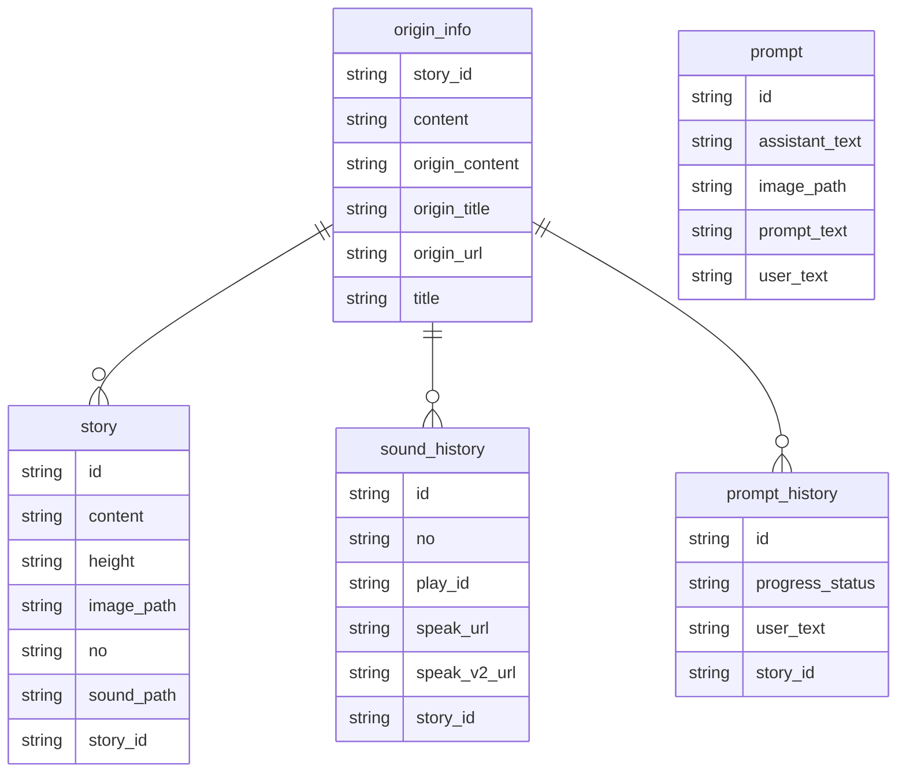

## pycache

```bash
find . | grep -E "(__pycache__|\.pyc|\.pyo$)" | xargs rm -rf
```

## ER-Diagram



### Flask

```bash
python -m venv venv
# windows
source venv/Scripts/activate
# mac
source venv/bin/activate

# setting
python -m pip install --upgrade pip
pip freeze > requirements.txt
pip install -r requirements.txt

pip install --upgrade pip
pip install Flask
pip install python-dotenv
pip install pyjwt
pip install pillow
pip install psutil
pip install requests
pip install boto3
pip install mysqlclient
pip install Flask-MySQLdb
pip install mysql-connector-python
pip install flask_sqlalchemy
pip install pymysql
# 암호화 사용시
pip install cryptography

# mac
## mysql_native_password.so' (no such file)
brew install mysql pkg-config
brew uninstall mysql
brew install mysql@8.4

# Linux (Ubuntu)
apt-get install -y pkg-config python-dev default-libmysqlclient-dev libssl-dev
sudo apt-get install scrot
```

### docker-compose.yml

```bash
cd docker
curl -o docker-compose.yml https://raw.githubusercontent.com/oseongryu/docker-composes/refs/heads/main/automation/docker-compose.yml
cd desktop
curl -o Dockerfile https://raw.githubusercontent.com/oseongryu/docker-composes/refs/heads/main/automation/desktop/Dockerfile
docker-compose up --build -d desktop
```

## exec file (windows)

```bash
pip install pyinstaller
pyinstaller -w -F automation.py
```

## exec file (mac)

```bash
pip install py2app

py2applet --make-setup commonconverter.py
rm -rf build dist
python setup.py py2app -A
```

## references

```
https://py2app.readthedocs.io/en/latest/tutorial.html#building-for-deployment
```

```
https://raw.githubusercontent.com/oseongryu/til/refs/heads/main/public/img/android/001.png
```
