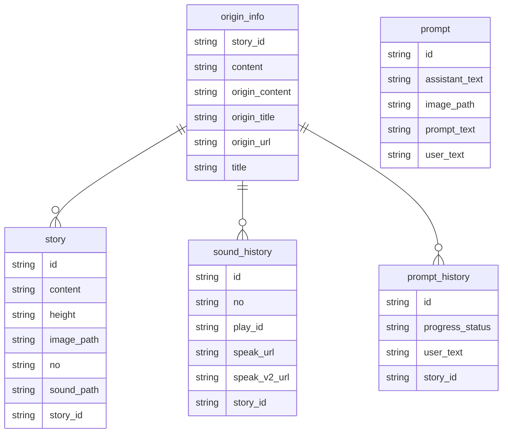

### Flask 실행

```bash
flask run

# 확인
http://127.0.0.1:8091/aws/
```

### flow

```mermaid
  info
```

## ER-Diagram



## setting
```bash
python -m venv venv
# windows
source venv/Scripts/activate
# mac
source venv/bin/activate

# linumx
sudo apt-get install scrot


pip install --upgrade pip
pip install pyautogui
pip install selenium
pip install webdriver_manager
pip install pillow
pip install opencv-python
pip install fake-useragent
pip install psutil
pip install requests
pip install beautifulsoup4
```

## setup

```bash
pip freeze > requirements.txt
pip install -r requirements.txt
```

## exec file (windows)

```bash
pip install pyinstaller
pyinstaller -w -F automation.py

```

## exec file (mac)
```bash
pip install py2app

py2applet --make-setup commonconverter.py
rm -rf build dist
python setup.py py2app -A
```
## references
https://py2app.readthedocs.io/en/latest/tutorial.html#building-for-deployment


### Flask

```bash

python -m venv venv
# windows
source venv/Scripts/activate
# mac
source venv/bin/activate

# mac
brew install mysql pkg-config
pip install mysqlclient

# Linux (Ubuntu)
apt-get install -y pkg-config python-dev default-libmysqlclient-dev libssl-dev 

pip install --upgrade pip
pip install Flask
pip install Flask-MySQLdb
pip install python-dotenv
pip install mysql-connector-python
pip install gTTS
touch .flaskenv

flask run
```


